<p align="center">
  
</p>

<p align="center">
  <a href="mailto:pravijain31@gmail.com"></a>
  <a href="https://www.linkedin.com/in/pravi-jain-50b366285/"></a>
  <a href="https://YOUR-PORTFOLIO.com"></a>
</p>

---

## About

```
building   full-stack apps
learning   cloud & devops — aws, docker, ci/cd
college    BMSIT, Bengaluru · BE 2027
awards     2nd runner-up — defy'26 hackathon
status     open to SWE internships
```

---

## Stack


---

## Featured projects

### Corporate Jargon Translator

Paste a sentence full of corporate jargon, get a blunt plain-English translation back. Scores the input on a BS-O-Meter, highlights every buzzword with hover tooltips, and exports the result as a shareable image. Serverless end to end — Amplify hosts the frontend, API Gateway routes to Lambda, and Claude Haiku does the translating.


---

### AI Email SaaS Client

Semantic email search and automated drafting. RAG pipelines over Weaviate embeddings handle retrieval, RabbitMQ runs the async workflows, and Gemini handles intent detection for drafting and scheduling.


---

### AI Cloud Cost Whisperer

An AWS cost dashboard that explains billing spikes in plain English and suggests fixes. Pulls from Cost Explorer under least-privilege IAM, fetches nightly via cron, and stores cost history in MongoDB Atlas.


---

## Stats
<p align="center">
  
</p>

<p align="center">
  
</p>
